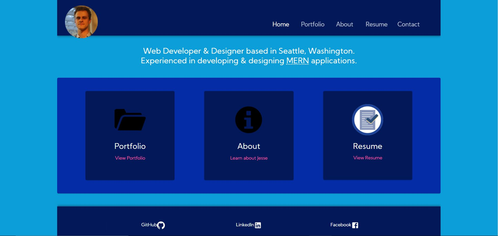

# [Jesse Mazur Portfolio](https://jmazur-react-portfolio.herokuapp.com/)
      

## Description
Portfolio Website for Web Developer Jesse Mazur.

Includes Five Pages:

- A **Home** page at the site's landing point.

- A **Portfolio** page that displays some of Jesse's projects.

- An **About** page that provides some information about Jesse

- A **Resume** page that displays Jesse's resume

- A **Contact** page that contains information on how to communicate with Jesse.

## Site Technologies

- **Node.js** JavaScript runtime environment.
- **Express** Web application framework.
- **React** JavaScript library for user interfaces.
- **Material UI** React user interface framework.
- **React-PDF** Module that Displays PDFs as images within React apps.
- **React-SizeMe** Module that makes React components aware of their size.

## Notable Features

- *ThemeProvider* A Material UI component that leverages react Context to provide css to elements throughout the site.
- *Slide* A Material UI component that adds sliding animations to the site.
- *Mobile Responsive Design* A combination of Grids and Media Queries provide a pleasant user experience on small viewports and mobile devices.

## License

Copyright (c) 2020 Jesse Mazur

Permission is hereby granted, free of charge, to any person obtaining a copy
of this software and associated documentation files (the "Software"), to deal
in the Software without restriction, including without limitation the rights
to use, copy, modify, merge, publish, distribute, sublicense, and/or sell
copies of the Software, and to permit persons to whom the Software is
furnished to do so, subject to the following conditions:

The above copyright notice and this permission notice shall be included in all
copies or substantial portions of the Software.

THE SOFTWARE IS PROVIDED "AS IS", WITHOUT WARRANTY OF ANY KIND, EXPRESS OR
IMPLIED, INCLUDING BUT NOT LIMITED TO THE WARRANTIES OF MERCHANTABILITY,
FITNESS FOR A PARTICULAR PURPOSE AND NONINFRINGEMENT. IN NO EVENT SHALL THE
AUTHORS OR COPYRIGHT HOLDERS BE LIABLE FOR ANY CLAIM, DAMAGES OR OTHER
LIABILITY, WHETHER IN AN ACTION OF CONTRACT, TORT OR OTHERWISE, ARISING FROM,
OUT OF OR IN CONNECTION WITH THE SOFTWARE OR THE USE OR OTHER DEALINGS IN THE
SOFTWARE.

## Contributing

## Tests

## Questions

